# SortingAlgorithms

A desktop app for learning sorting and searching by watching each decision. Pick an algorithm, press play, and the bars rearrange while a sentence explains what just happened and why.

The sample list is `8, 3, 7, 1, 9, 2, 6, 4, 10, 5`. Bubble Sort starts playing as soon as the window opens. Each algorithm below has a short recording of that list, then a still of one step.

## What a step looks like

Orange bars are the values being compared. A line connects that pair, and a label under each bar names its role (`comparing`, `pivot`, `middle`, `end`, and so on). Green bars are in their final place. Values outside the current step are dimmed, and a blue wash marks the part of the list still in play. A found search target is teal.

## Sorting algorithms

| Algorithm | Time | Extra space | Stable | What to watch |
| --- | --- | --- | --- | --- |
| Bubble Sort | O(n²), O(n) best if it stops early | O(1) | Yes | Large values bubbling to the end |
| Selection Sort | O(n²) always | O(1) | No | The minimum of the unsorted part moving into the next open spot |
| Insertion Sort | O(n²), O(n) best when nearly sorted | O(1) | Yes | A value swapping left into the sorted group |
| Merge Sort | O(n log n) always | O(n) | Yes | Halves being split, then merged by taking the smaller front value |
| Quick Sort | O(n log n) average, O(n²) worst | O(log n) calls | No | The pivot landing in its final spot |
| Heap Sort | O(n log n) always | O(1) | No | The array as a tree, then the root moving to the end |

Stable means equal values keep their original order.

### Bubble Sort

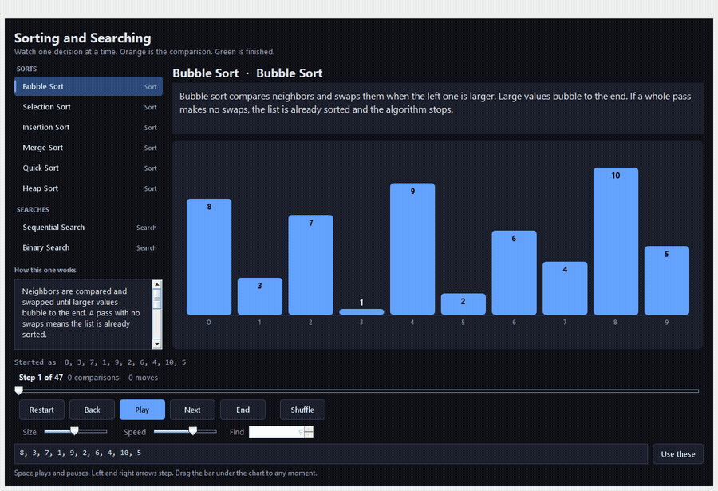

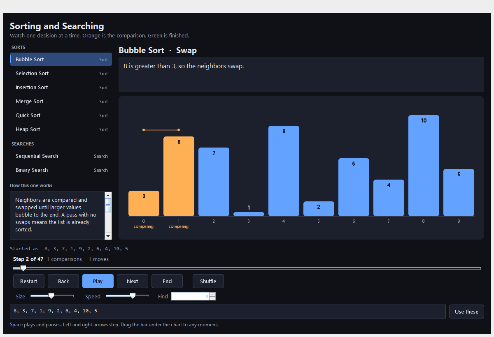

Neighbors are compared. Here 8 is greater than 3, so those two bars swap. After a full pass, the largest remaining value sits at the end in green. A pass with no swaps means the list is already sorted, and the algorithm stops early.

### Selection Sort

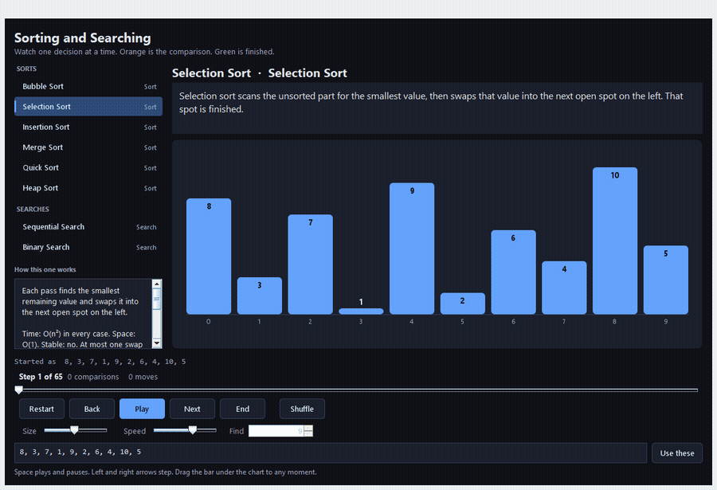

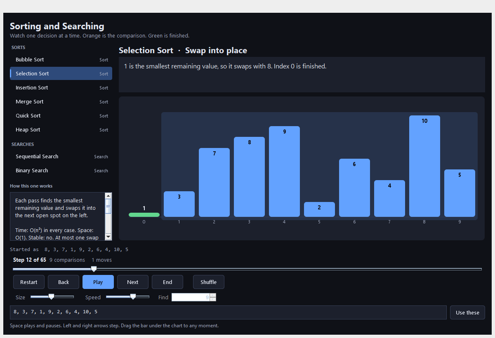

Each pass scans the unsorted part for the smallest value and swaps it into the next open spot on the left. Here 1 swaps with 8, and index 0 is finished. That spot will not change again.

### Insertion Sort

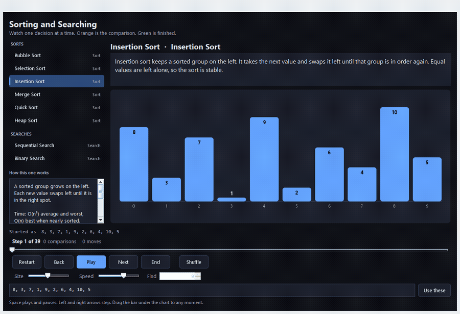

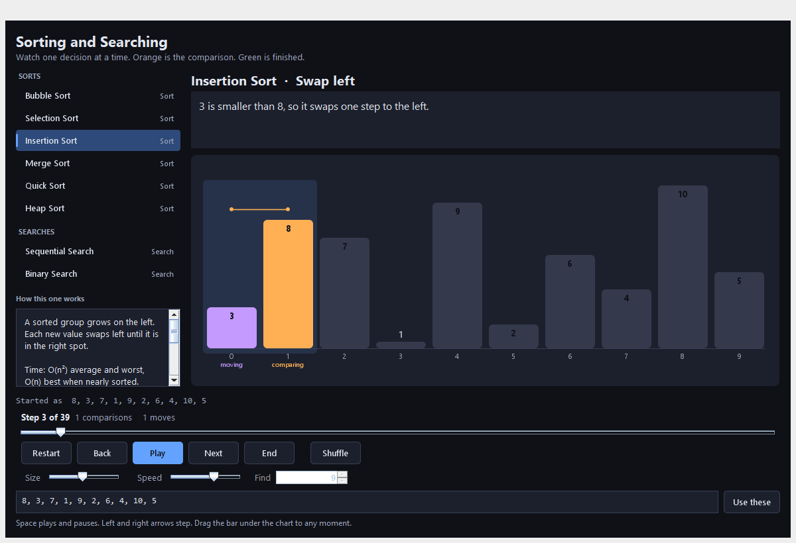

A sorted group grows on the left. The next value swaps left until it is in the right spot. Here 3 is smaller than 8, so it moves one step left. The bars outside that group are dimmed because they have not been inserted yet.

### Merge Sort


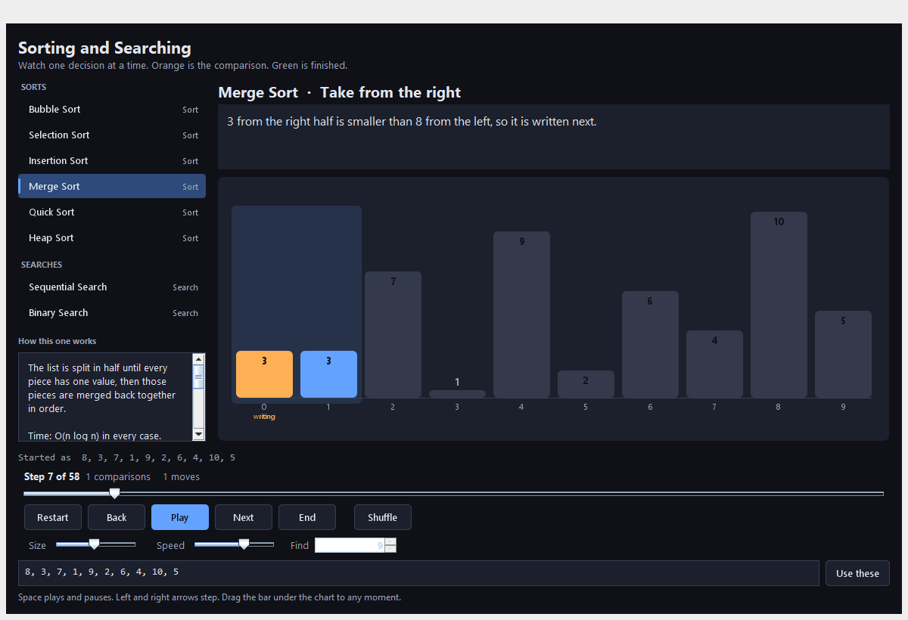

The list is split until every piece has one value, then those pieces are merged. Each write takes the smaller value from the front of the two halves. Here 3 from the right half is smaller than 8 from the left, so it is written next. A tie takes the left value, which keeps equal items in their original order.

### Quick Sort

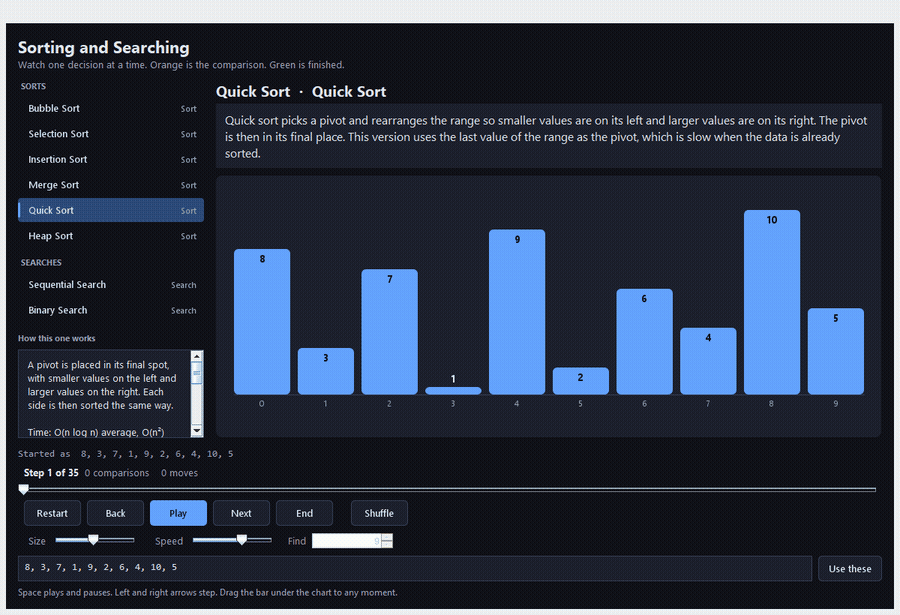

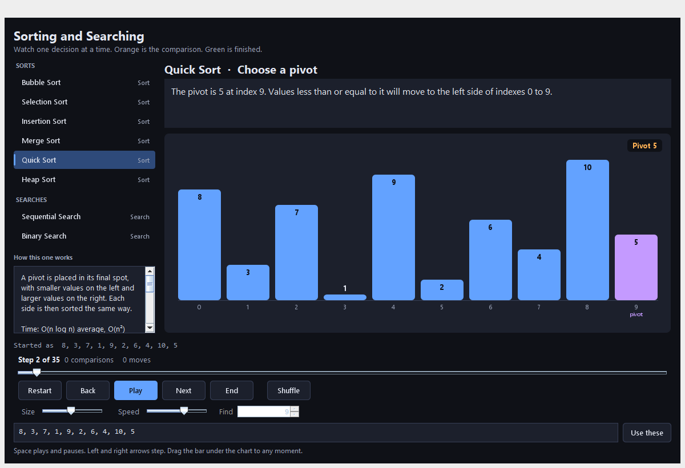

This version uses the last value in the current range as the pivot, shown in purple. Smaller or equal values move to its left, larger values stay on the right, and the pivot is then in its final place. Each side is sorted the same way. Already-sorted data is a slow case for this pivot choice.

### Heap Sort

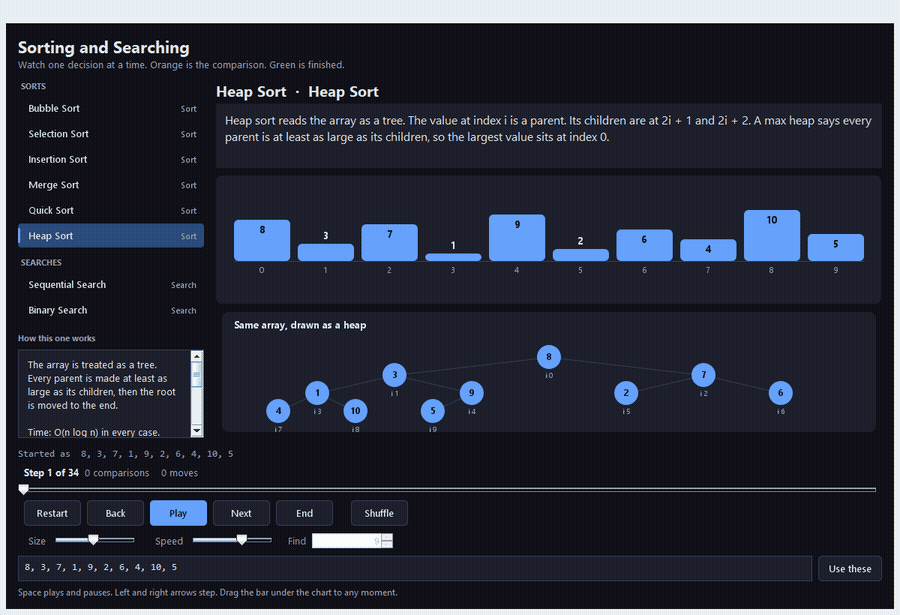

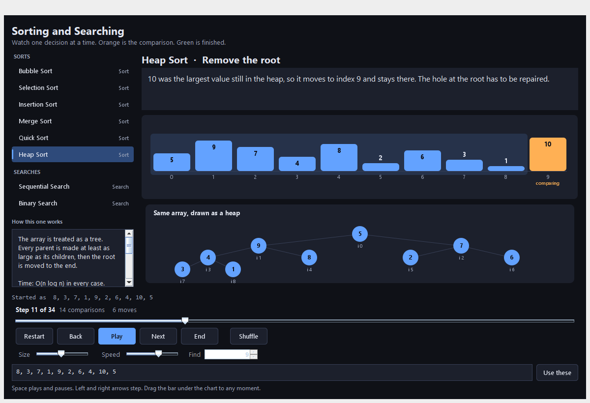

The same array is drawn twice: as bars, and as a tree. The value at index `i` is a parent. Its children are at `2i + 1` and `2i + 2`. A max heap keeps every parent at least as large as its children, so the largest value sits at the root. That root is moved to the end, marked finished, and the heap is repaired.

## Searching algorithms

### Sequential Search

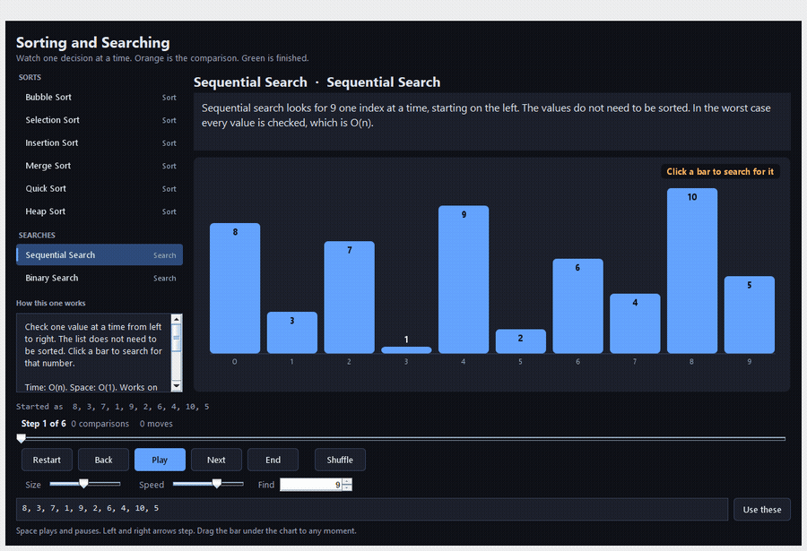

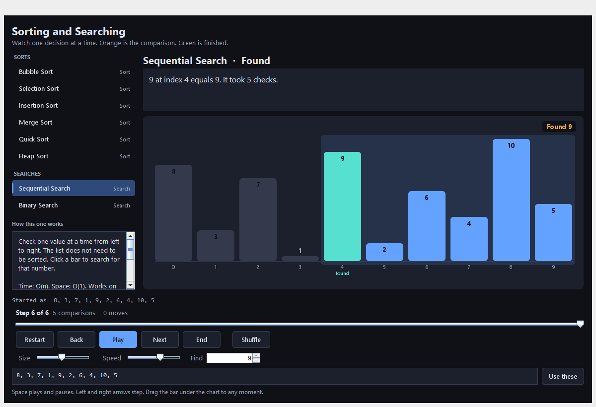

Values are checked from left to right. The list does not need to be sorted. Here 9 is the target, and it is found at index 4 after five checks. The found bar is teal. Bars already passed are dimmed.

| Algorithm | Time | Needs sorted data | What to watch |
| --- | --- | --- | --- |
| Sequential Search | O(n) | No | One index checked at a time, from left to right |
| Binary Search | O(log n) | Yes | Low, high, and the middle. Half the range is thrown away each check |

Click any bar during a search to look for that number, or type a number in **Find**.

### Binary Search

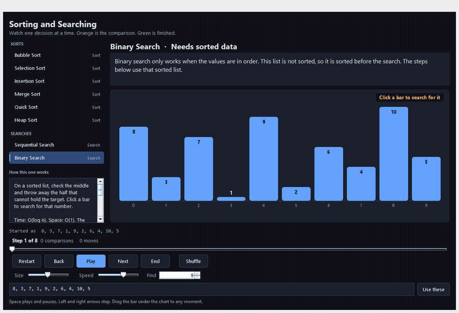

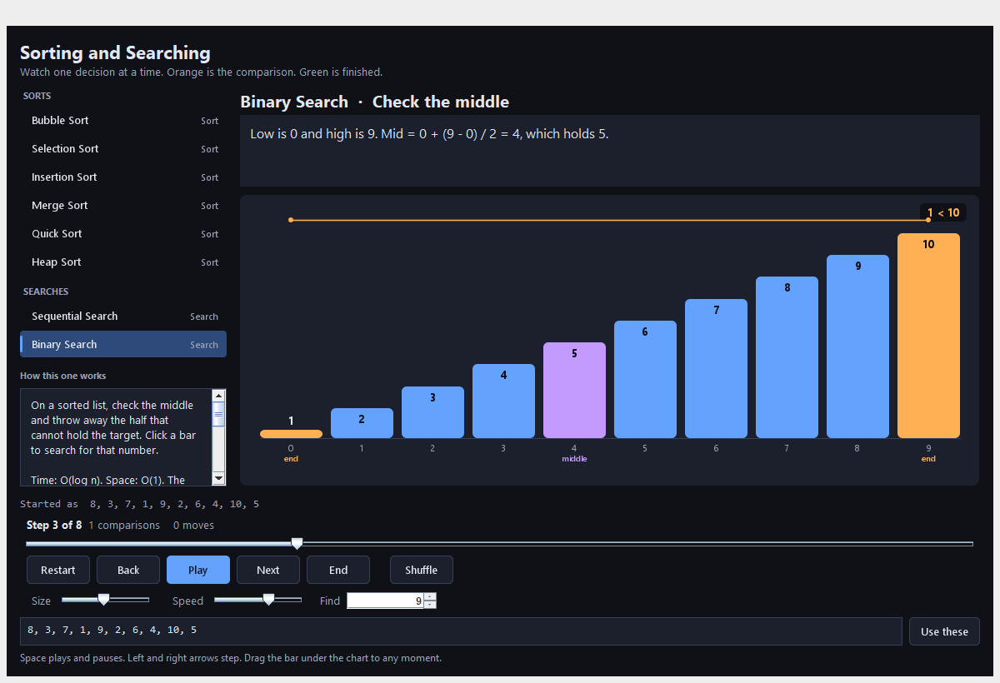

Binary search only works on sorted data. If the list is out of order, the app sorts a copy first and says so. The steps after that use the sorted list, so the index it reports belongs to that sorted copy.

Low and high are the ends of the range that might still hold the target. The middle is purple. Each check discards the half that cannot contain the number. The formula shown in the app is `mid = low + (high - low) / 2`.

## Controls

- **Play / Pause** starts and stops the run. Space does the same thing.
- **Back** and **Next** move one step. The left and right arrow keys do the same thing.
- **Restart** and **End** jump to the first or last step.
- The slider under the step counter scrubs to any moment in the run.
- **Speed** is faster toward the right.
- **Size** builds a new random list. **Shuffle** does that with the current size.
- Type whole numbers separated by commas or spaces, then **Use these**. Up to 20 numbers.
- **Find** is the search target. It is used by Sequential Search and Binary Search.

Comparisons and moves are counted on the current step, so stepping backward restores the earlier totals.

## Run

Open the project in IntelliJ and run `com.jaredscarito.sortalgorithms.main.SortingAlgorithms`.

From the project folder:

```bash
javac -encoding UTF-8 -d out/production/SortingAlgorithms $(find src -name '*.java')
java -cp out/production/SortingAlgorithms com.jaredscarito.sortalgorithms.main.SortingAlgorithms
```

The source is written for Java 8.
